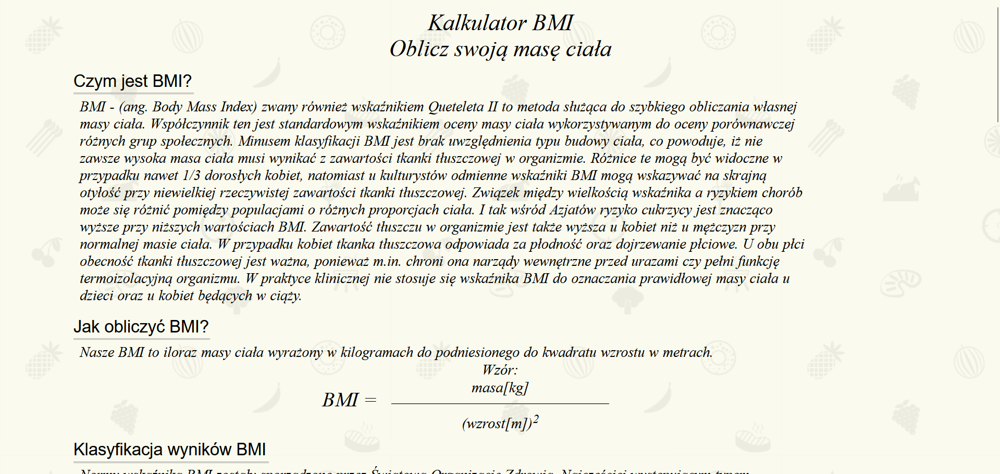
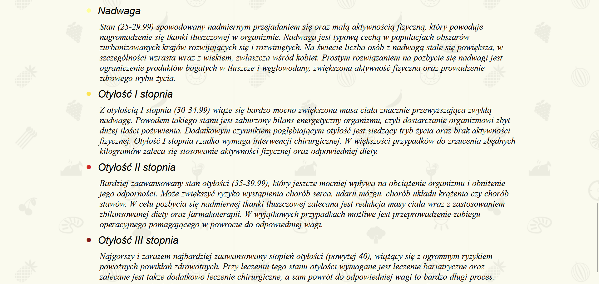
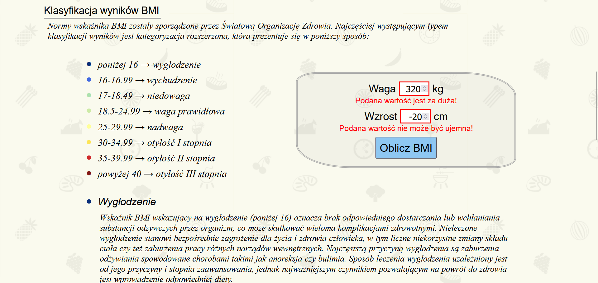
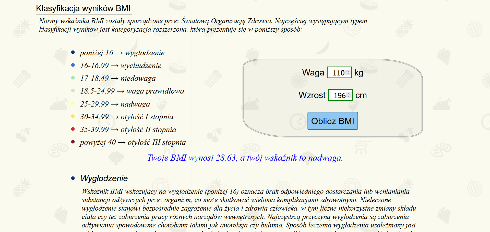

# ***[Projekt BMI](https://szulczyk.pl/projekt-1/bmi)***

## 🖼️ ***Zrzuty ekranu***

 

## 📄 ***Opis projektu***
### ✅ *Projekt zakończony dnia 13.09.2024*
### *Projekt oferuje intuicyjny kalkulator BMI, który pozwala na błyskawiczne obliczenie własnego wskaźnika masy ciała. Aplikacja zawiera szczegółowy opis wszystkich zakresów BMI wraz z ich bezpośrednim wpływem na zdrowie człowieka. Kluczowym atutem narzędzia są zaawansowane zabezpieczenia, które blokują wprowadzenie błędnych lub nieodpowiednich wartości. Dzięki temu użytkownik ma pewność, że otrzymane wyniki są rzetelne i poprawne.*

 

## 🛠️ ***Stack projektu***
- ### *Frontend*
  - ### *HTML5*
  - ### *CSS3*
  - ### *JavaScript*
- ### *Backend*
  - ### *Brak użytych technologii*
- ### *Bazy danych*
  - ### *Brak użytych technologii*

 

## 📌 ***Podsumowanie projektu***
### 🎯 *Głównym celem projektu było stworzenie funkcjonalnego kalkulatora BMI, pozwalającego na praktyczne wykorzystanie samodzielnie nabytej wiedzy z zakresu HTML, CSS oraz JavaScript. Jako mój pierwszy autorski projekt, stanowi on fundament mojego portfolio i pierwszy krok w profesjonalnym tworzeniu stron internetowych.*
### 💡 *Czego się nauczyłem:*
- ### *Sprawne szukanie rozwiązań - nauczyłem się, jak szybko znajdować odpowiedzi w sieci i przerabiać je tak, by pasowały do mojego kodu.*
- ### *Łączenie kodu w całość - zobaczyłem, jak w praktyce HTML, CSS i JS współpracują ze sobą, tworząc działającą stronę.*
- ### *Pierwsze kroki z klasami w JS - przećwiczyłem używanie klas, żeby mój kod był lepiej uporządkowany i logiczny.*
- ### *Układanie strony (RWD) - opanowałem ustawianie pudełek (floatowanie) i dobieranie wielkości tak, by strona dobrze wyglądała na każdym ekranie.*
- ### *Dbanie o oko użytkownika - skupiłem się na tym, żeby strona była po prostu ładna, przejrzysta i wygodna dla każdego, kto na nią wejdzie.*

 

## 📨 ***Kontakt***
- ### 📧 *E-mail -* przemo.ppk@gmail.com
- ### 💻 *Discord -* darkcoder97